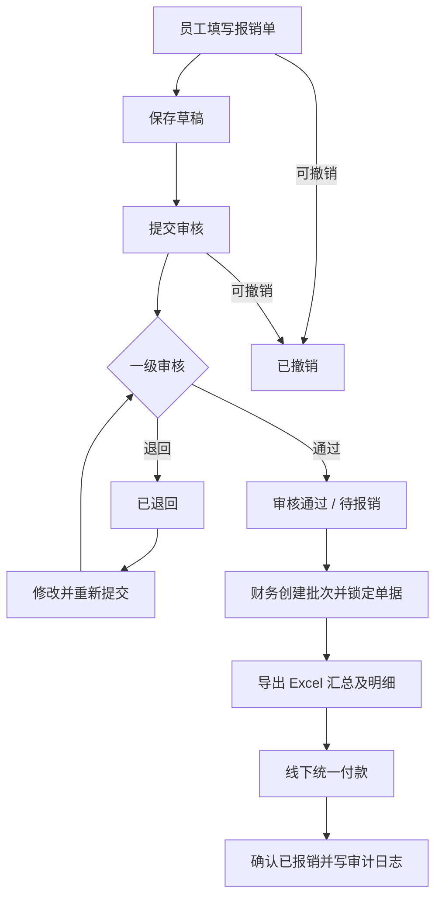

# 澄序财务｜第一版设计草案

此文件是配套 HTML 原型的**下一阶段后端实施设计建议**，不是当前静态演示已经实现的服务端能力。

## 页面原型导航

| 角色 | 页面 | 主要职责 |
|---|---|---|
| 全部账号 | 登录、工作台 | 演示登录、按身份显示关键指标和入口 |
| 员工 | 新建报销、我的报销单、历史记录 | 草稿、多费用项目、票据、退回重提、撤销、查看进度 |
| 审核员 | 待我审核、审核记录 | 查看分配单据、通过/退回和填写意见 |
| 财务 | 财务待报销、报销批次、数据统计 | 归集、防重复、Excel 汇总/明细、确认打款 |
| 管理员 | 用户管理、审核配置、类别管理、操作日志 | 基础配置与追溯 |

## 主要业务流程



后端应对每次状态迁移做鉴权并记录操作人、时间和操作前后状态。已报销的金额及原始费用明细不可原地编辑；更正应另外增加调整流程。

## 推荐数据库模型（PostgreSQL）

金额优先用 `BIGINT amount_cents` **整数分**持久化，也可以用 `DECIMAL(18,2)`；避免使用 `FLOAT/DOUBLE`。主键推荐 UUID，外部单号另设唯一约束。

| 表 | 关键字段 | 要点 |
|---|---|---|
| `users` | id, username, password_hash, name, department_id, status | 密码使用 Argon2id 或同等级安全哈希；不得保存明文 |
| `departments` | id, name, status | 部门基础资料 |
| `user_roles` | user_id, role_code | 可支持同用户兼任多个角色及服务端 RBAC |
| `payee_accounts` | id, user_id, account_ciphertext, bank_name, last4 | 收款账户加密；只有授权财务服务可解密 |
| `expense_categories` | id, name, enabled | 保留历史类别，不随停用清除 |
| `reimbursement_requests` | id, request_no UNIQUE, applicant_id, department_id, category_id, reason, remark, status, total_cents, revision, submitted_at, approved_at, paid_at, created_at, updated_at | 申请主表；部门和申请人关联，提交前重算总额 |
| `reimbursement_items` | id, request_id, category_id, expense_date, description, amount_cents, sort_order | 一对多费用明细，合计必须与主表一致 |
| `attachments` | id, item_id, object_key, file_name, mime_type, file_size, sha256, uploaded_by | 附件存私有对象存储，下载前服务端鉴权 |
| `approval_routes` | id, department_id, enabled | 审批路线；第一版每个部门只设一个活跃路线 |
| `approval_steps` | id, route_id, step_number, reviewer_id | 为未来多级审核预留 |
| `approval_actions` | id, request_id, revision, step_number, reviewer_id, decision, comment, decided_at | 每轮审核单独存，不覆盖历史意见 |
| `reimbursement_batches` | id, batch_no UNIQUE, created_by, status, created_at, completed_at | 归集批次主表 |
| `batch_memberships` | id, batch_id, request_id, is_active, amount_snapshot_cents | 记录历史归属；每张申请在任意时点只能属于一个有效批次 |
| `payment_confirmations` | id, batch_id, request_id, confirmed_by, confirmed_at, remark | 付款确认的操作轨迹；以后可以关联实际付款凭证 |
| `audit_logs` | id, actor_id, event_type, target_type, target_id, before_json, after_json, created_at, request_id | 审计日志，服务端追加、业务用户不可编辑 |
| `export_logs` | id, batch_id, exported_by, exported_at, scope, file_hash | 财务导出留痕与校验 |

### 防重复报销的核心约束

建议在 `batch_memberships` 为 `is_active=true` 的 `request_id` 建立**部分唯一索引**，保证同一张报销单在有效批次中只能出现一次：

```sql
CREATE UNIQUE INDEX uq_one_active_batch_per_request
ON batch_memberships (request_id)
WHERE is_active = TRUE;
```

创建批次必须在数据库事务内完成：锁定待归集单据、检查 `APPROVED` 状态和是否已有活跃归属、插入批次和成员、变更状态、写审计日志，任何一步失败则整体回滚。财务重复点击、并发请求也必须被数据库约束拦截。

### 金额、Excel 和付款一致性

- 明细保存为整数分，服务端总额根据明细重新计算，不信任前端上传的金额。
- 批次保存成员和加入时金额快照；导出的 Excel 明细、汇总和系统记录应使用**同一个已确认的事务快照**生成，并可记录文件 SHA-256。
- 只有授权财务人员可读取和导出收款账号；非财务角色仅展示脱敏信息。
- 付款确认应采用幂等操作，以唯一付款确认记录和状态条件更新保证重复提交不会重复登记。
- 日志、附件和业务数据库分别备份；规划最小权限与恢复演练。

## 正式系统推荐架构

- **前端**：沿用此响应式页面方案，拆分成组件化前端（React/Vue 或原生 JS）。
- **Web/API 服务**：Vercel Functions 或独立 Node.js 服务，所有权限判定在服务端完成。
- **数据库**：PostgreSQL（可使用托管数据库）。
- **附件**：私有对象存储，上传大小/MIME/内容验证、授权下载、留存策略。
- **认证与授权**：正式会话、密码安全哈希、登录限制、细粒度角色+数据范围校验。
- **部署**：Vercel 用于前端；后端和数据库具备可靠的事务、安全存储、日志与备份。

验收前至少测试：退回重提时保留原审批历史；重复归集的并发请求只成功一次；非授权用户直接调用 API 无法读取单据或附件；已报销金额不能原地修改；导出所有金额与批次快照一致；在移动端能完成核心任务。
